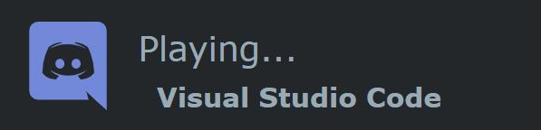
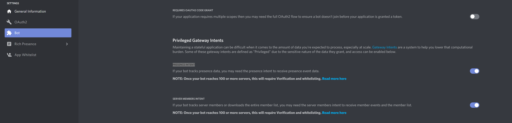
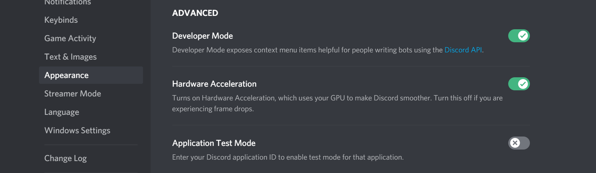
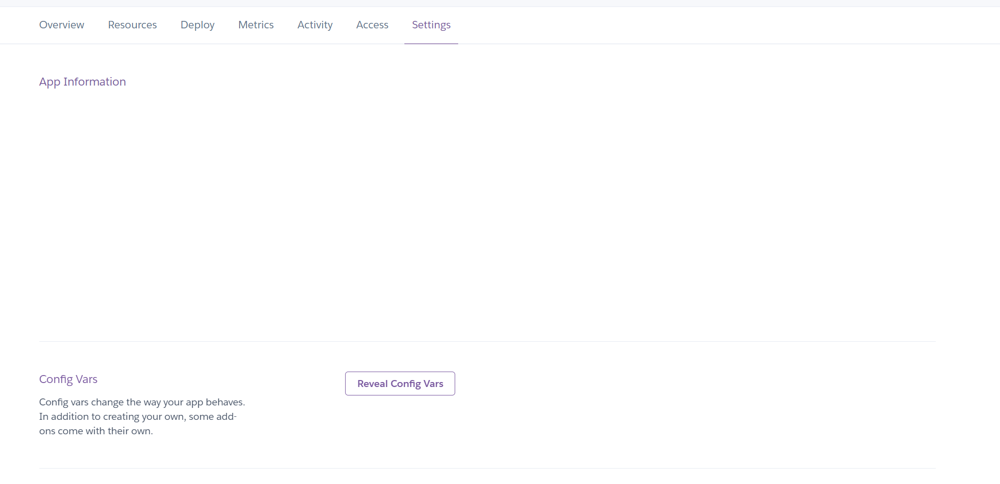
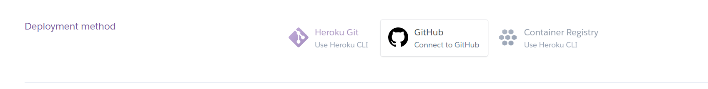

# Dynamically generated game you are currently playing on your readme profile!



## Brief explanation
To enable it, we need you to do few prerequisites:
* Discord server & bot added to it https://discordpy.readthedocs.io/en/latest/discord.html
* Discord Guild ID & User ID
* Heroku nodejs server to host our bot & server that returns image to our readme (or any other server if you have it)
* We can call it from our readme

# Lets start
## 1. In discord bot tab we need to enable "PRESENCE INTENT & SERVER MEMBERS INTENT"



## 2. Get Discord Guild ID & User ID
 


1. *click Settings Cog* (bottom left in discord, right to your name)
2. *Appearance -> Activate Developer Mode*
3. *Right click on you guild to get Guild ID*
4. *Right click on your user to get User ID*

## 2. Fork this repo to your Github app.

## 3. For our app to work we need to fill env variables in Heroku app first.
*To do that you should go to Settings -> Config Vars -> Reveal Config Vars*



### Env variables you need to fill are: 

* DISCORDTOKEN: *you get this when you make bot*
* GUILDID: *copied from discord*
* USERID: *copied from discord*

## 4. Connect this Github repo with Heroku. 



## 6. After deploying you should have URL something like 
https://discord-action-playing.herokuapp.com/

## 7. Put it in your readme file like 

```md
[](https://github.com/vely-digital/github-readme-discord-playing)
```
